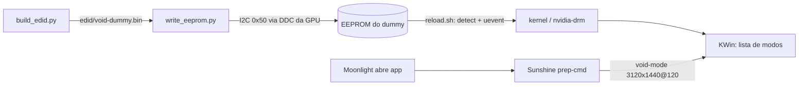

# dummy-edid

EDID próprio gravado direto na EEPROM de um **dummy plug HDMI**, pra ter as resoluções nativas
dos meus aparelhos no streaming (Sunshine → Moonlight) a partir de uma VM Linux com GPU NVIDIA.

| Aparelho | Tela | Modos no EDID |
|---|---|---|
| Galaxy S26 Ultra | 3120x1440 @ 120 Hz | 3120x1440, 2340x1080 (FHD+) e 1560x720 (HD+), todos a 120 Hz |
| Galaxy Tab S9 Ultra | 2960x1848 @ 120 Hz | 2960x1848 @ **90** e 2560x1600 @ 120 (16:10) |
| Desktop | — | 1920x1080 @ 60 (preferido) e @ 120, 4K @ 30 |

## Por que isso existe

A tela da VM é um dummy HDMI numa RTX 3080 (KDE Plasma no Wayland). Pra imagem do stream
preencher a tela do celular sem tarja nem esticar, a tela do host precisa estar na mesma
resolução do cliente. O caminho óbvio não funciona:

- **Custom mode não serve na NVIDIA.** O `kscreen-doctor ... addCustomMode` cria o modo, mas
  aplicar dá "o driver rejeitou a configuração de saída": o driver proprietário só aplica
  modos que estão no EDID.
- **Override de EDID por software também não.** O `CustomEDID` do driver NVIDIA só vale no
  X11, e o `drm.edid_firmware` do kernel não é caminho confiável com o driver proprietário
  (não testei aqui).

A saída é o próprio monitor anunciar os modos. Este dummy tem a EEPROM do EDID **gravável
pelo barramento DDC**, sem jumper de proteção. Deu pra gravar pelo `/dev/i2c-N` da própria
GPU, como usuário comum do grupo `video`, sem gravador externo.



## Estrutura

| Arquivo | O que faz |
|---|---|
| `build_edid.py` | Gera o EDID (256 bytes, bloco base + CTA-861) a partir da lista `MODES` |
| `write_eeprom.py` | Faz backup da EEPROM, grava o `.bin` em páginas de 8 bytes e confere; `--read` só lê |
| `reload.sh` | Faz o kernel e o KWin relerem o EDID (precisa de sudo) |
| `bin/void-mode` | Troca o modo do HDMI-A-1 por `WxH@F` pegando a frequência mais próxima |
| `edid/void-dummy.bin` | O EDID gravado hoje |
| `edid/original-xieoery-s06.bin` | EDID de fábrica do dummy, pra restaurar |
| `sunshine/apps.example.json` | Apps do Sunshine usados (troque `/home/USER`) |
| `sunshine/make_covers.py`, `sunshine/covers/` | Capas dos apps no Moonlight |

## Uso

Dependências: `python3`, `edid-decode` (calcula os timings e valida), `kscreen-doctor` e
`python-pillow`, esta última só pras capas.

```bash
# 1. achar o barramento I2C do conector (aqui: /dev/i2c-3 = card1-HDMI-A-1)
ddcutil detect

# 2. editar MODES em build_edid.py, gerar e validar
python3 build_edid.py
edid-decode --check edid/void-dummy.bin        # tem que terminar em "EDID conformity: PASS"

# 3. gravar (salva o conteúdo anterior em edid/backup-*.bin antes)
python3 write_eeprom.py edid/void-dummy.bin /dev/i2c-3

# 4. fazer a placa e o KWin relerem
./reload.sh
```

Pra voltar ao EDID de fábrica: `python3 write_eeprom.py edid/original-xieoery-s06.bin && ./reload.sh`.

## Limites que definiram a lista de modos

**Banda do HDMI 2.0 (TMDS até 600 MHz).** Com CVT reduced blanking v2:

| Modo | Pixel clock | Cabe? |
|---|---|---|
| 3120x1440 @ 120 | 585,6 MHz | ✅ por pouco |
| 2560x1600 @ 120 | 536,7 MHz | ✅ |
| 2960x1848 @ 90 | 527,5 MHz | ✅ |
| 2960x1848 @ 120 | 713,5 MHz | ❌ só com HDMI 2.1 (FRL) ou YCbCr 4:2:0 |

Daí o Tab S9 Ultra ter duas opções: resolução nativa a 90 Hz, ou 2560x1600 (mesma proporção)
a 120 Hz. Pra passar de 340 MHz, o EDID precisa de um **HF-VSDB** (bloco do HDMI Forum)
anunciando 600 MHz; só o VSDB do HDMI 1.4 não basta.

**Tamanho da EEPROM: 256 bytes (24C02).** São só 2 blocos: o base (2 DTDs + faixa + nome) e
um CTA-861, onde cabem ~5 DTDs depois dos data blocks. Por isso os modos de 60 Hz dos
aparelhos saíram e só o desktop ficou com 60.

**Detalhes do formato que já quebraram o EDID uma vez:**
- O DTD guarda o *Vfront porch* em 6 bits (máx. 63). O CVT-RB2 a 120 Hz pede mais (ex.: 71),
  então o excesso vai pro *Vback*, com o mesmo Vblank total e o mesmo timing.
- *Standard timings* só vão até 2288 de largura; 2560 não entra ali.
- A spec HDMI exige EDID 1.3 no bloco base.

## Integração com o Sunshine

Cada app do Sunshine troca o modo no `prep-cmd` e volta pra 1080p60 no `undo`:

```json
{ "do": "/home/USER/.local/bin/void-mode 3120x1440@120",
  "undo": "/home/USER/.local/bin/void-mode 1920x1080@60" }
```

No Moonlight, a resolução escolhida tem que ser a mesma do app. No S26 Ultra, por exemplo,
use "Nativa Tela Cheia (3120x1440)" com o app 3120x1440, e os fps em 120.

O `void-mode` existe porque o `kscreen-doctor` não aceita frequência com casas decimais
(`1920x1080@119.88` dá erro de parse). Já `1920x1080@120` casava com **outro** modo
(aplicava 3120x1440@120). O script procura o id do modo com essa resolução e a frequência
mais próxima, e aplica pelo id.

## Pegadinhas

- **Gravar não basta, a placa tem que reler o EDID.** O `detect` no sysfs atualiza só o
  kernel (`/sys/class/drm/<conn>/modes`). O KWin continua com a lista antiga até receber um
  uevent de change na drm. O `reload.sh` faz os dois e confere com `cmp`.
- **Confira com `cmp`, não pelo "funcionou".** Um app cujo modo já existia na versão anterior
  do EDID continua funcionando mesmo que a releitura não tenha acontecido.
- Hardware usado: dummy HDMI "Xieoery S06" (EDID de fábrica: fabricante XMD, 3440x1440 máx.).
  Outros dummies podem ter a EEPROM protegida contra escrita; o `write_eeprom.py` detecta
  isso na conferência e aborta com "DIVERGE!".
